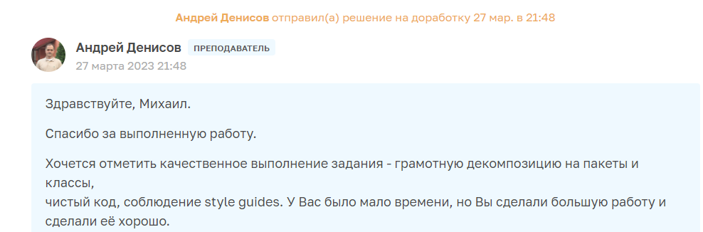

## Облачное хранилище
- файлы сохраняются на диске сервера
- для аутентификации используется jwt
- тесты junit mockito mockMvc test container покрывают 100% 
- хранение пользователей в postgres
- доступно OpenApi swagger
## Дописываю фронт. Через пару дней будет доступно по адресу http://mslfox.ru/storage/

 
  
